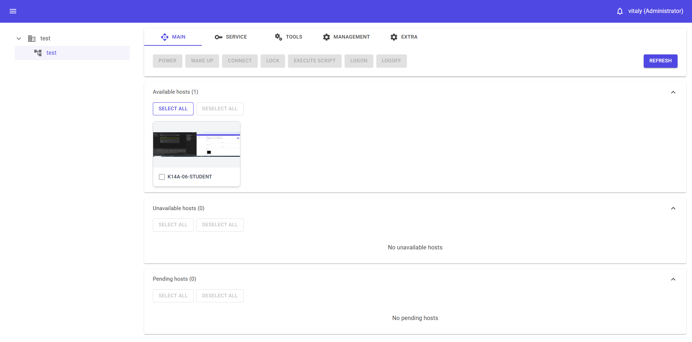
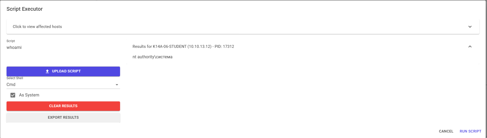
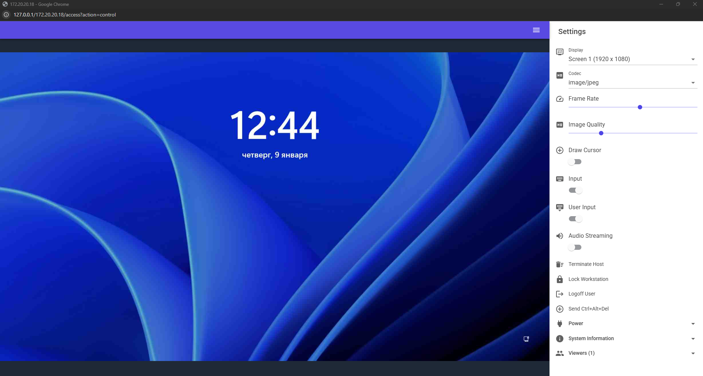
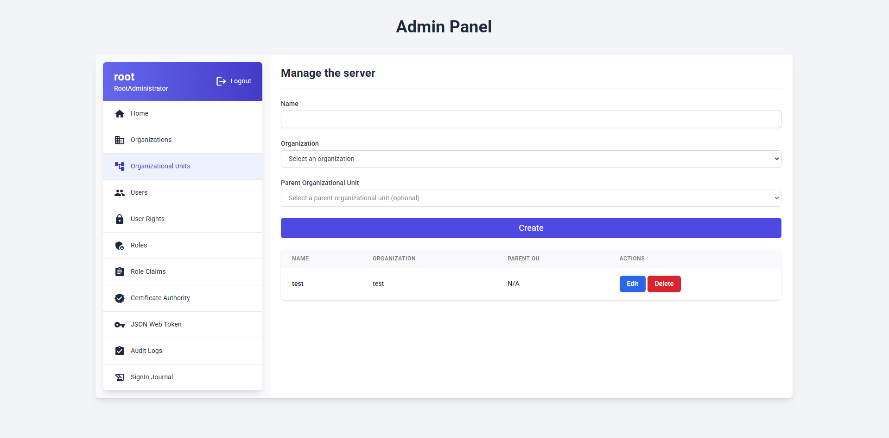
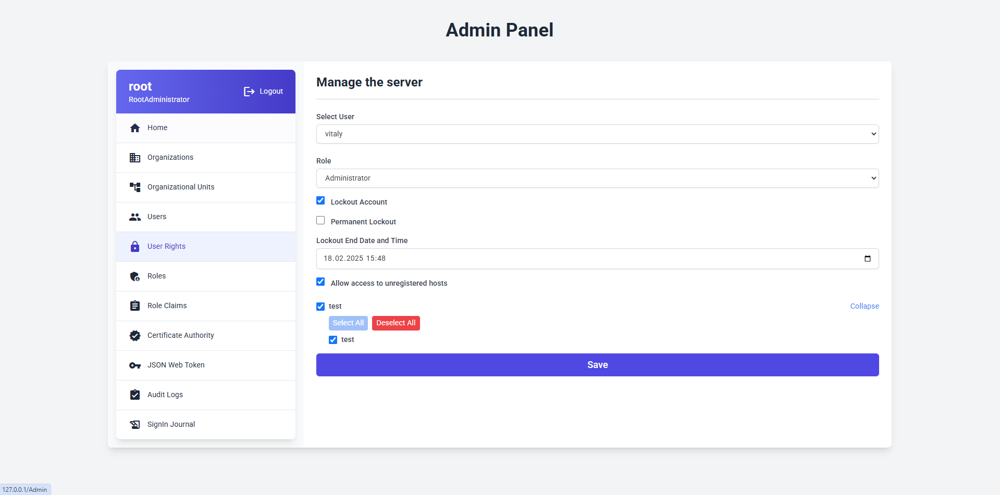
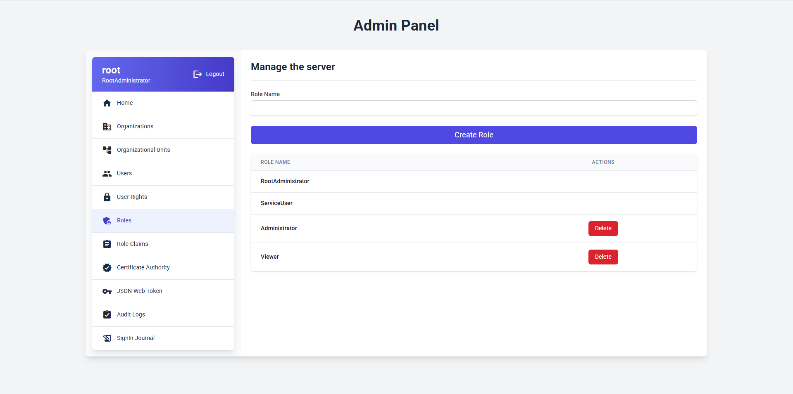
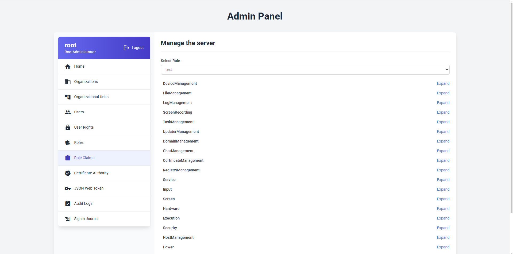
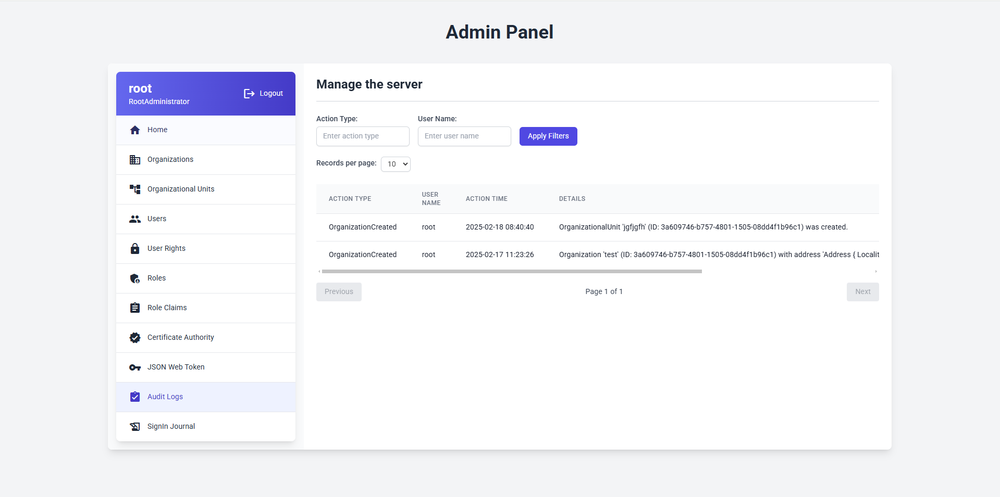
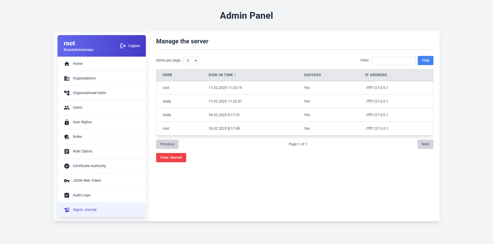

# RemoteMaster Legacy

[🇷🇺 Русская версия](#русская-версия) · [🇬🇧 English version](#english-version)

## Русская версия

### Содержание
- [Обзор](#обзор)
- [Скриншоты](#скриншоты)
- [Ключевые возможности](#ключевые-возможности)
- [Архитектура решения](#архитектура-решения)
- [Стек технологий](#стек-технологий)
- [Начало работы](#начало-работы)
  - [Предварительные требования](#предварительные-требования)
  - [Клонирование и восстановление зависимостей](#клонирование-и-восстановление-зависимостей)
  - [Настройка сервера](#настройка-сервера)
- [Запуск компонентов](#запуск-компонентов)
  - [RemoteMaster Server](#remotemaster-server-1)
  - [Агент для Windows](#агент-для-windows)
  - [Агент для Linux](#агент-для-linux)
- [Тестирование](#тестирование)
- [Справочник по настройкам](#справочник-по-настройкам)
- [Структура проекта](#структура-проекта)
- [Лицензия](#лицензия)

### Обзор
RemoteMaster — это кроссплатформенный комплекс удалённого управления, разработанный для администраторов и команд поддержки, которым требуется централизованно контролировать Windows- и Linux-хосты. Платформа объединяет веб-интерфейс, REST и SignalR API, а также устойчивые агенты, запускаемые как службы Windows или демоны systemd. Основные сценарии включают:

- Управление сессиями удалённого доступа с потоковой передачей изображения и звука в реальном времени.
- Безопасное выполнение скриптов с многоуровневыми согласованиями и журналированием операций.
- Регистрацию устройств, применение политик, оркестрацию Wake-on-LAN и ведение инвентаризации активов.
- Централизованное управление жизненным циклом сертификатов, включая интеграцию с Active Directory Certificate Services.
- Уведомления (в том числе через Telegram) и мониторинг состояния инфраструктуры.

Все компоненты ориентированы на .NET 9 и построены с учётом непрерывной доставки, автоматизированного тестирования и оптимизаций под конкретные платформы.

### Скриншоты
#### Веб-интерфейс




#### Административная панель









### Ключевые возможности
**Управление парком устройств**
- Процесс регистрации агентов с политиками для разных организаций, JWT-аутентификацией и контролем доступа по тарифным планам.
- Службы инвентаризации, собирающие аппаратные метрики, состояние сессий и сведения об операционной системе для Windows- и Linux-агентов.
- Оркестрация Wake-on-LAN и управление сетевыми ресурсами для подготовки машин к удалённым сессиям.

**Удалённая поддержка и автоматизация**
- Захват экрана, звука и ввода с использованием оптимизированных под платформу технологий (GDI на Windows, X11/DBus на Linux) и низколатентных хабов SignalR.
- Движок удалённого выполнения с поддержкой PowerShell/bash, запуском команд и планировщиком задач автоматизации.
- Синхронизация буфера обмена, файловые операции, редактирование реестра (Windows) и эмуляция Secure Attention Sequence для привилегированных действий.

**Безопасность и соответствие требованиям**
- Инструменты встроенного или интегрированного с ADCS центра сертификации с выпуском, продлением и отзывом сертификатов.
- Сервис токенов с RSA-подписью, хранением refresh-токенов и сценариями MFA через Telegram-уведомления.
- Гранулярная авторизация на основе пользовательских требований, политик домена и организационного разделения.

**Надёжность и наблюдаемость**
- Health-check проверки для SQL Server и SQLite, фоновые миграции и сервисы очистки базы данных.
- Структурированное логирование и трассировка с использованием Serilog (консоль, Seq, ASP.NET Core).
- Компоненты устойчивости на базе `Microsoft.Extensions.Resilience` для HTTP- и SignalR-клиентов.

### Архитектура решения
RemoteMaster состоит из нескольких взаимодействующих проектов:

| Слой | Назначение | Основные обязанности |
| --- | --- | --- |
| **RemoteMaster.Server** | Веб-приложение ASP.NET Core | REST/SignalR API, UI на MudBlazor, идентификация и авторизация, доступ к данным через EF Core, службы сертификатов, уведомления, оркестрация обновлений. |
| **RemoteMaster.Host.Core** | Базовая инфраструктура агентов | Командный интерфейс, аутентификация через JWT, SignalR-клиент, абстракции экрана/звука, диспетчер команд, логирование. |
| **RemoteMaster.Host.Windows** | Агент для Windows | Хостинг как Windows-служба, захват экрана через GDI, поток звука с NAudio, инициализация брандмауэра и SAS, управление реестром/питанием, интеграция с PsExec. |
| **RemoteMaster.Host.Linux** | Агент для Linux | Интеграция с systemd, управление питанием через DBus, захват экрана X11, мониторинг окружения, иконка в трее, аппаратное профилирование. |
| **RemoteMaster.Shared** | Общие контракты и сервисы | DTO, перечисления, опции, валидаторы и сервисы, используемые сервером и агентами. |
| **Тестовые проекты (`*.Tests`)** | Автоматизированные проверки | Наборы тестов на xUnit для сервера, общих библиотек и логики агентов. |

Скрипты в каталоге `scripts/` помогают с упаковкой, цифровой подписью Windows-агентов и оптимизацией разработки.

### Стек технологий
| Область | Технологии |
| --- | --- |
| Backend | .NET 9, ASP.NET Core, SignalR, ASP.NET API Versioning, EF Core (SQL Server и SQLite), Identity, Health Checks |
| UI | MudBlazor, TypeScript, Tailwind CSS, PostCSS |
| Агенты | .NET 9, System.CommandLine, Serilog, ImageSharp, расширения FFMpegCore, Windows SDK/Win32 metadata, NAudio, systemd hosting, Tmds.DBus |
| Интеграции и инструменты | Serilog sinks (Seq/консоль), Telegram.Bot, Active Directory Certificate Services, Wake-on-LAN |
| Тестирование | xUnit, конвейер на FluentResults |

### Начало работы
#### Предварительные требования
- [.NET 9 SDK](https://dotnet.microsoft.com/download) (предварительная версия до выхода релиза).
- Node.js 20+ для сборки веб-активов.
- SQL Server (локальный или удалённый) для основной базы данных приложения. Для вспомогательных хранилищ используется SQLite.
- Опционально: доступ к Active Directory Certificate Services и Telegram Bot API для соответствующих интеграций.

#### Клонирование и восстановление зависимостей
```bash
# клонирование репозитория
git clone https://github.com/your-org/RemoteMaster-Legacy.git
cd RemoteMaster-Legacy

# восстановление .NET-зависимостей
dotnet restore

# установка фронтенд-зависимостей для сервера
cd RemoteMaster.Server
npm install
cd ..
```

#### Настройка сервера
Скопируйте шаблон файла настроек и обновите строки подключения и секреты:
```bash
cp RemoteMaster.Server/appsettings.template.json RemoteMaster.Server/appsettings.Development.json
```
Критичные параметры:
- `ConnectionStrings` — точки подключения к SQL Server для основных хранилищ.
- `Jwt` — RSA-ключи, значения issuer/audience и время жизни токенов.
- `CertificateAuthority` — выбор внутреннего ЦС или интеграции с ADCS и соответствующие учётные данные.
- `Update` — UNC-пути и учётные данные для распространения обновлений агентов.
- `Telegram` — токен бота и идентификаторы чатов для уведомлений.

### Запуск компонентов
#### RemoteMaster Server
```bash
dotnet run --project RemoteMaster.Server
```
Сервер запускает ASP.NET Core-хост, отдаёт веб-интерфейс и обслуживает SignalR-хабы для живых сессий. Статические ресурсы собираются автоматически через интеграцию MSBuild с TypeScript и Tailwind.

#### Агент для Windows
```bash
dotnet run --project RemoteMaster.Host.Windows --framework net9.0-windows
```
Во время разработки агент можно запускать в консольном режиме. Для продакшн-развёртывания опубликуйте самодостаточный пакет и установите его как Windows-службу:
```bash
dotnet publish RemoteMaster.Host.Windows -c Release -r win-x64 /p:PublishSingleFile=true
```
Скрипт `scripts/DigitalSignExecutable.ps1` выполняет цифровую подпись полученного бинарного файла при наличии сертификатов.

#### Агент для Linux
```bash
dotnet run --project RemoteMaster.Host.Linux
```
Для подготовки дистрибутива:
```bash
dotnet publish RemoteMaster.Host.Linux -c Release -r linux-x64 --self-contained true /p:PublishSingleFile=true
```
Полученный бинарник можно зарегистрировать как службу systemd, используя шаблоны unit-файлов из каталога `scripts/`.

### Тестирование
Запустите весь набор тестов из корня репозитория:
```bash
dotnet test
```
Все модульные и интеграционные тесты используют .NET 9. Убедитесь, что предварительная версия SDK установлена.

### Справочник по настройкам
Файл `RemoteMaster.Server/appsettings.template.json` документирует все доступные параметры. Важные примеры:
- **Update pipeline** — управляет размещением бинарных файлов агентов, политикой форсированных обновлений и учётными данными для защищённых ресурсов.
- **Certificate services** — переключает режимы внутреннего и внешнего ЦС, задаёт параметры публикации CRL и расписание обновления сертификатов.
- **Security** — ключи подписи JWT, политики cookies и сценарии Telegram-уведомлений в качестве дополнительного фактора.
- **Branding & UI** — настраиваемые заголовки, темы и параметры локализации интерфейса MudBlazor.

### Структура проекта
```
RemoteMaster.Server/          # ASP.NET Core сервер, API, UI, интеграции
RemoteMaster.Host.Core/       # Общая инфраструктура агентов
RemoteMaster.Host.Windows/    # Windows-агент с сервисами автоматизации рабочего стола
RemoteMaster.Host.Linux/      # Linux-агент с интеграцией DBus/X11
RemoteMaster.Shared/          # DTO, опции и общие утилиты
*.Tests/                      # Тестовые проекты xUnit для каждого компонента
scripts/                      # Вспомогательные скрипты сборки, публикации и подписи
version.json                  # Метаданные семантической версии
```

### Лицензия
RemoteMaster Legacy распространяется по лицензии **GNU Affero General Public License v3.0**. В каждом исходном файле присутствует соответствующий лицензионный заголовок.

---

## English version

### Table of contents
- [Overview](#overview)
- [Screenshots](#screenshots)
- [Feature highlights](#feature-highlights)
- [Solution architecture](#solution-architecture)
- [Technology stack](#technology-stack)
- [Getting started](#getting-started)
  - [Prerequisites](#prerequisites)
  - [Clone and restore dependencies](#clone-and-restore-dependencies)
  - [Configure the server](#configure-the-server)
- [Running the solution](#running-the-solution)
  - [RemoteMaster Server](#remotemaster-server)
  - [Windows host agent](#windows-host-agent)
  - [Linux host agent](#linux-host-agent)
- [Testing](#testing)
- [Configuration reference](#configuration-reference)
- [Project structure](#project-structure)
- [License](#license)

### Overview
RemoteMaster is a cross-platform remote management suite built for administrators and support teams that need unified control over Windows and Linux hosts. The platform combines a web interface, REST and SignalR APIs, and resilient host agents running as Windows services or systemd daemons. Core capabilities include:

- Real-time remote sessions with high-fidelity screen and audio streaming.
- Secure script execution with approval workflows and audit logging.
- Device enrollment, policy enforcement, Wake-on-LAN orchestration, and asset inventory.
- Centralized certificate lifecycle management, including Active Directory Certificate Services integration.
- Push notifications (including Telegram) and infrastructure health monitoring.

### Screenshots
#### Web UI


#### Admin panel


Every component targets .NET 9 and is designed for continuous delivery, automated testing, and platform-specific optimizations.

### Feature highlights
**Fleet management**
- Agent registration pipeline with organization-aware policies, JWT authentication, and plan-based access control.
- Inventory services covering hardware telemetry, session state, and OS metadata for both Windows and Linux agents.
- Wake-on-LAN orchestration and network drive preparation to ready machines for remote sessions.

**Remote assistance & automation**
- Screen, audio, and input capture optimized per platform (GDI on Windows, X11/DBus on Linux) with low-latency SignalR hubs.
- Remote execution engine supporting PowerShell/bash scripts, command dispatch, and scheduled automation jobs.
- Clipboard synchronization, file operations, registry editing (Windows), and Secure Attention Sequence emulation for privileged tasks.

**Security & compliance**
- Built-in or ADCS-backed certificate authority tooling with issuance, renewal, and CRL endpoints.
- Token services with RSA signing, refresh token storage, and MFA-friendly flows via Telegram notifications.
- Granular authorization through custom requirements, domain policies, and organization scoping.

**Reliability & observability**
- Health checks for SQL Server and SQLite stores, background migrations, and database cleanup services.
- Structured logging and distributed tracing powered by Serilog sinks (console, Seq, ASP.NET Core).
- Resilience primitives via `Microsoft.Extensions.Resilience` for HTTP and SignalR clients.

### Solution architecture
RemoteMaster is composed of several collaborating projects:

| Layer | Purpose | Key responsibilities |
| --- | --- | --- |
| **RemoteMaster.Server** | ASP.NET Core web application | REST/SignalR API surface, MudBlazor-powered UI, identity & authorization, EF Core data access, certificate services, notifications, update orchestration. |
| **RemoteMaster.Host.Core** | Shared host foundation | Command-line bootstrapper, JWT-based authentication, SignalR client connectors, screen/audio abstraction, command dispatch, logging. |
| **RemoteMaster.Host.Windows** | Windows-specific agent | Windows service hosting, GDI-based screen capture, audio streaming with NAudio, firewall & SAS initialization, registry/power management, PsExec integration. |
| **RemoteMaster.Host.Linux** | Linux-specific agent | Systemd integration, DBus power management, X11 screen capture, environment monitoring, tray integration, hardware probing. |
| **RemoteMaster.Shared** | Cross-cutting contracts | DTOs, enums, options, validation primitives, shared services for server and agents. |
| **Test projects (`*.Tests`)** | Automated test suites | xUnit-based coverage for server, shared libraries, and host logic. |

Scripts under `scripts/` assist with packaging, digital signing of Windows agents, and developer workflows.

### Technology stack
| Area | Technologies |
| --- | --- |
| Backend | .NET 9, ASP.NET Core, SignalR, ASP.NET API Versioning, EF Core (SQL Server & SQLite), Identity, Health Checks |
| UI | MudBlazor, TypeScript, Tailwind CSS, PostCSS |
| Host agents | .NET 9, System.CommandLine, Serilog, ImageSharp, FFMpegCore extensions, Windows SDK/Win32 metadata, NAudio, systemd hosting, Tmds.DBus |
| Tooling & integrations | Serilog sinks (Seq/console), Telegram.Bot, Active Directory Certificate Services, Wake-on-LAN |
| Testing | xUnit, FluentResults-based pipeline |

### Getting started
#### Prerequisites
- [.NET 9 SDK](https://dotnet.microsoft.com/download) (preview channel until GA).
- Node.js 20+ for building web assets.
- SQL Server (local or remote) for the primary application database. SQLite backs several auxiliary stores.
- Optional: Access to Active Directory Certificate Services and the Telegram Bot API for corresponding integrations.

#### Clone and restore dependencies
```bash
# clone the repository
git clone https://github.com/your-org/RemoteMaster-Legacy.git
cd RemoteMaster-Legacy

# restore .NET dependencies
dotnet restore

# install frontend tooling for the server
cd RemoteMaster.Server
npm install
cd ..
```

#### Configure the server
Copy the template settings file and update connection strings and secrets:
```bash
cp RemoteMaster.Server/appsettings.template.json RemoteMaster.Server/appsettings.Development.json
```
Key settings to review:
- `ConnectionStrings`: SQL Server endpoints for core data stores.
- `Jwt`: RSA keys, issuer/audience values, and token lifetimes.
- `CertificateAuthority`: choose between the internal CA or ADCS integration and provide credentials.
- `Update`: UNC paths and credentials for distributing host updates.
- `Telegram`: bot token and chat identifiers for notifications.

### Running the solution
#### RemoteMaster Server
```bash
dotnet run --project RemoteMaster.Server
```
The server hosts the ASP.NET Core application, exposes the web UI, and serves SignalR hubs for live sessions. Static assets are built automatically through the MSBuild integration with TypeScript and Tailwind.

#### Windows host agent
```bash
dotnet run --project RemoteMaster.Host.Windows --framework net9.0-windows
```
During development the agent can run in console mode. For production deployments publish a self-contained package and install it as a Windows service:
```bash
dotnet publish RemoteMaster.Host.Windows -c Release -r win-x64 /p:PublishSingleFile=true
```
The post-publish script under `scripts/DigitalSignExecutable.ps1` digitally signs the resulting binary when signing certificates are available.

#### Linux host agent
```bash
dotnet run --project RemoteMaster.Host.Linux
```
To prepare a deployable artifact:
```bash
dotnet publish RemoteMaster.Host.Linux -c Release -r linux-x64 --self-contained true /p:PublishSingleFile=true
```
The produced binary can be registered as a systemd service using the provided unit templates under `scripts/`.

### Testing
Execute the entire test suite from the repository root:
```bash
dotnet test
```
All unit and integration tests target .NET 9. Ensure the preview SDK is installed before running the command.

### Configuration reference
`RemoteMaster.Server/appsettings.template.json` documents every configurable option. Examples include:
- **Update pipeline** – controls where new host binaries are stored, whether forced updates are allowed, and credentials for secured shares.
- **Certificate services** – toggles internal vs external CAs, CRL publishing parameters, and certificate renewal scheduling.
- **Security** – JWT signing keys, cookie policies, and optional Telegram-based second factor notifications.
- **Branding & UI** – customizable titles, themes, and localization settings for the MudBlazor interface.

### Project structure
```
RemoteMaster.Server/          # ASP.NET Core server, API, UI, integrations
RemoteMaster.Host.Core/       # Shared host infrastructure
RemoteMaster.Host.Windows/    # Windows agent with desktop automation services
RemoteMaster.Host.Linux/      # Linux agent with DBus/X11 integrations
RemoteMaster.Shared/          # DTOs, options, common utilities
*.Tests/                      # xUnit test projects for each component
scripts/                      # Build, publish, and signing helpers
version.json                  # Semantic version metadata
```

### License
RemoteMaster Legacy is distributed under the **GNU Affero General Public License v3.0**. Each source file includes the standard license header.
